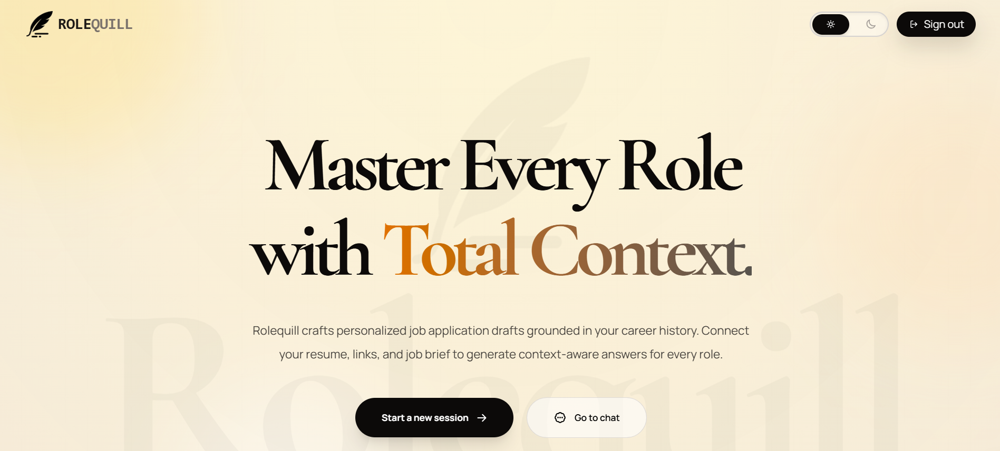
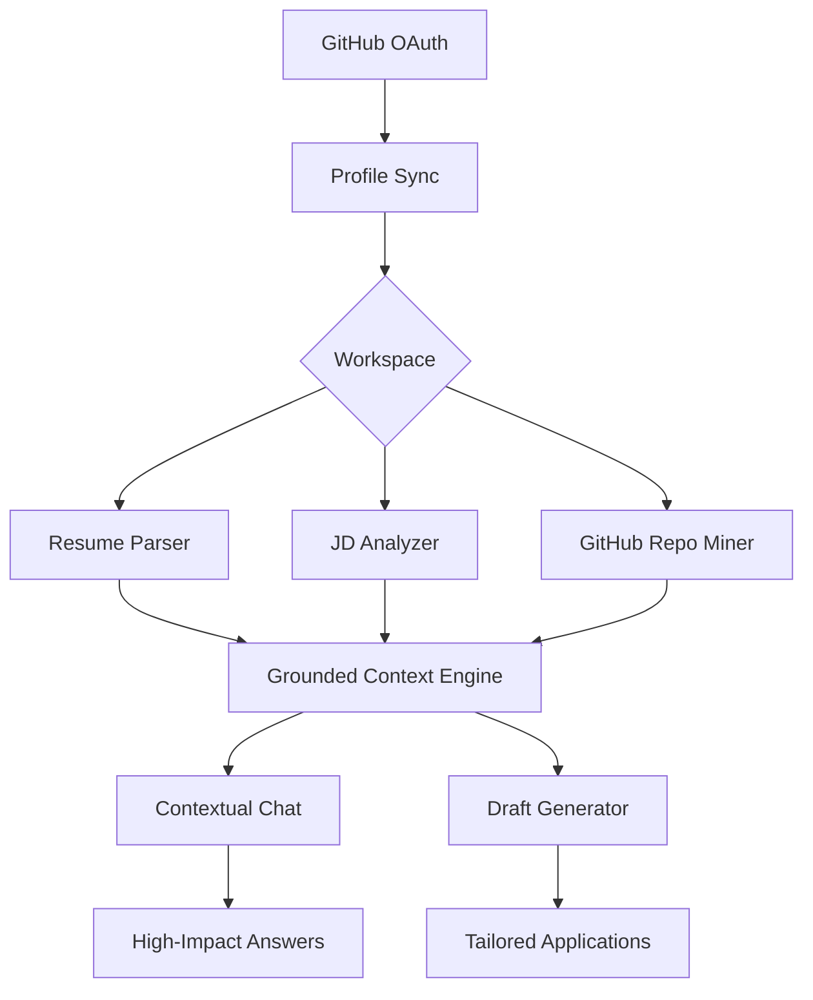

# Rolequill

<p align="center">
  
</p>

<h2 align="center">Master Every Role with Total Context</h2>

<p align="center">
  <strong>Grounded AI drafting workspace for resumes, job descriptions, and GitHub-verified project answers.</strong>
</p>

<p align="center">
  
  
  
  
</p>

---

## 🖋️ What is Rolequill?

Rolequill isn't just another AI chatbot. It's a **grounded workspace** designed for applicants who want their claims to be backed by evidence. By syncing your GitHub repositories and analyzing your resume against target JDs, Rolequill ensures your application drafts are high-impact and hallucination-free.

### Why it feels different:

- **🔗 Grounded Answers**: Repository README content is treated as the primary source of truth.
- **🧠 Role-Aware Chat**: The assistant understands the context of the specific role you're applying for.
- **🎯 Project Shortlisting**: Identifies the strongest matches from your profile instead of dumping everything into a prompt.

---

## 🛠️ The Experience

<p align="center">
  
</p>

### 🚀 Core Features

| 🛡️ Grounded Context | 📂 GitHub Sync |
| :--- | :--- |
| Uses resume, JD, and repo metadata to build tight, defensible project claims. | Pulls real-time repository data from your OAuth session for deep analysis. |

| 💬 Contextual Chat | 📝 Intelligent Drafting |
| :--- | :--- |
| Grounded Q&A that knows when to pull from your JD versus your repo history. | Generates four distinct, role-specific application drafts from your source context. |

---

## 📐 Product Architecture



---

## 🚦 Getting Started

<details>
<summary><b>1. Prerequisites</b></summary>

- Groq API Key
- GitHub OAuth Application
- Node.js & npm
</details>

<details>
<summary><b>2. Environment Setup</b></summary>

Create a `.env.local` file in the root:

```env
GROQ_API_KEY=your_groq_api_key
GROQ_MODEL=openai/gpt-oss-20b

NEXTAUTH_URL=http://localhost:3000
AUTH_SECRET=your_nextauth_secret
AUTH_GITHUB_ID=your_github_oauth_client_id
AUTH_GITHUB_SECRET=your_github_oauth_client_secret
```
</details>

<details>
<summary><b>3. Installation</b></summary>

```bash
npm install
npm run dev
```
</details>

---

## 🏗️ Technical Stack

- **Framework**: [Next.js 16](https://nextjs.org/)
- **UI**: [React 19](https://reactjs.org/) + [Tailwind CSS 4](https://tailwindcss.com/)
- **Auth**: [NextAuth.js](https://next-auth.js.org/)
- **LLM**: [Groq SDK](https://groq.com/)
- **Parsing**: [Cheerio](https://cheerio.js.org/), [unpdf](https://github.com/unjs/unpdf)

---

## 📜 License

Distributed under the ISC License. See `LICENSE` for more information.

<p align="right">(<a href="#top">back to top</a>)</p>

---
Built with ❤️ by [Komal](https://komalpreet.me)
